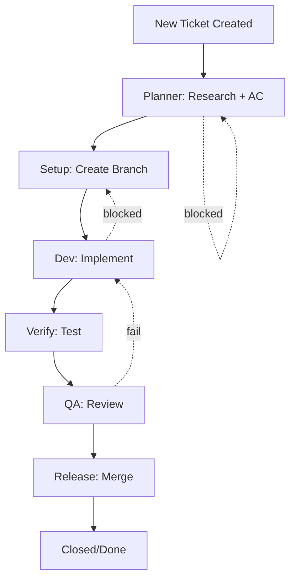

# Ralph Loop - Self-Running Ticket Orchestrator

## Overview
The Ralph Loop is an automated workflow where specialized AI agents pick up tickets and move them through the entire lifecycle from creation to closure without manual intervention.

## Agent Pool (The Team)

| Agent | Role | When Spawned |
|-------|------|--------------|
| @planner | Research & AC definition | Ticket created |
| @setup | Branch creation & prep | Planning complete |
| @dev | Implementation | Setup complete |
| @verify | Self-testing & verification | Dev complete |
| @qa | Quality assurance | Verify complete |
| @release | Merge & deploy | QA complete |

## Loop Flow



## Phase Details

### Phase 0: Ticket Creation (PM/Remy)
- **Who:** Remy (you)
- **What:** Create ticket, define initial scope
- **Output:** Ticket exists with status "To Research" or "To Dev"
- **Auto-action:** Spawn @planner

### Phase 1: Planner
- **Agent:** @planner (researcher/analyst)
- **Duration:** 5-15 min
- **Tasks:**
  - Research code/context
  - Define Acceptance Criteria
  - Write implementation plan
  - Set Ralph workflow steps
- **Exit:** AC defined → Comment to Remy → Move to "To Dev"
- **Blockers:** If AC unclear → Ask clarifying questions

### Phase 2: Setup
- **Agent:** @setup (dev-ops/setup)
- **Duration:** 2-5 min
- **Tasks:**
  - Create feature/REMY-XXX-... branch
  - Verify clean branch from main
  - Update ticket with branch name
- **Exit:** Branch created → Comment to Remy → Move to "In Dev"
- **Blockers:** Branch exists → Skip

### Phase 3: Dev (The Build)
- **Agent:** @dev (fe-dev, api-dev, or general dev)
- **Duration:** 10-30 min
- **Tasks:**
  - Implement per AC
  - Commit with [TICKET-XXX] prefix
  - Self-test locally
  - Verify builds
- **Exit:** Code committed → Comment to Remy → Move to "In QA"
- **Blockers:** AC unclear → Return to Planner

### Phase 4: Verify
- **Agent:** @verify (same dev or specialist)
- **Duration:** 5-10 min
- **Tasks:**
  - Run tests
  - Verify all AC pass
  - Check no console errors
  - Confirm branch pushed
- **Exit:** All green → Comment to Remy → Move to "In QA"

### Phase 5: QA
- **Agent:** @qa (quality assurance)
- **Duration:** 10-20 min
- **Tasks:**
  - Review implementation
  - Test edge cases
  - Verify AC satisfaction
  - Check code quality
- **Exit:** Pass → Move to "Ready for Review"
- **Blockers:** Fail → Return to Dev with feedback

### Phase 6: Release
- **Agent:** @release (tech-lead)
- **Duration:** 2-5 min
- **Tasks:**
  - Final code review
  - Merge to main
  - Delete feature branch
  - Close ticket
- **Exit:** Merged → Ticket status "Closed/Done"

## Loop Automation

### Trigger Conditions
1. **New ticket created** → Auto-spawn Planner
2. **Status changed** → Check if next phase agent needed
3. **Comment with "ready"** → Move to next phase
4. **No activity for X min** → Check for blockers

### Spawn Command Format
```bash
# Spawns appropriate agent for current phase
sessions_spawn agentId="planner" task="[REMY-XXX] Research and define AC"
sessions_spawn agentId="setup" task="[REMY-XXX] Create feature branch"
sessions_spawn agentId="dev" task="[REMY-XXX] Implement per AC"
sessions_spawn agentId="verify" task="[REMY-XXX] Self-test"
sessions_spawn agentId="qa" task="[REMY-XXX] QA review"
sessions_spawn agentId="release" task="[REMY-XXX] Merge to main"
```

## Agent Context Template

Each agent receives:
1. Ticket details
2. Current phase
3. Previous phase output
4. AC to satisfy
5. Branch name
6. Blocker history

## Communication Pattern

Agents report via `sessions_send`:
```
🎫 REMY-XXX
📍 Phase: [current]
📊 Progress: [summary]
🌿 Branch: [name]
💾 Commits: [count/list]
🚧 Blockers: [none or list]
🎯 Next: [what needs to happen]
```

Remy updates ticket automatically using `update-ticket.js`

## Error Handling

| Scenario | Action |
|----------|--------|
| Agent crashes | Respawn, continue from last checkpoint |
| Blocker not resolved | Escalate to human (you) |
| AC conflict | Pause, ask for clarification |
| Merge conflict | Auto-resolve or escalate |
| Build fails | Return to Dev with logs |

## Concurrency

- Max 3 agents running at once
- One agent per phase per ticket
- Agents can work on different tickets in parallel

## Human Override

You can:
- Pause any ticket
- Reassign to different agent
- Skip phases
- Add manual AC
- Cancel ticket

## Success Metrics

- Tickets flow without human intervention
- AC pass rate > 95%
- Phase transition time < 15 min
- Blocker resolution < 30 min

## Current Implementation

- ✅ Ticket created → Auto-comment by Remy
- ✅ Status tracking in DB
- ✅ Ralph workflow steps stored
- ⚠️ Agent spawning: Manual (via sessions_spawn)
- ❌ Auto-spawn on status change (needs implementation)
- ⚠️ Activity tracking: Broken (REMY-013)

## Next Steps for Full Automation

1. Fix activity tracking (REMY-013)
2. Create cron check every 5 min
3. Auto-spawn agents based on ticket status + phase
4. Auto-assign from agent pool
5. Discord notifications on blockers
6. Dashboard showing active agents

---
*Ralph Loop: AI agents working together* 🦞
